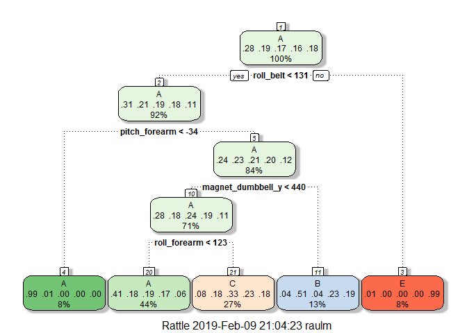

Introduction
------------

"Using devices such as Jawbone Up, Nike FuelBand, and Fitbit it is now possible to collect a large amount of data about personal activity relatively inexpensively. These type of devices are part of the quantified self movement - a group of enthusiasts who take measurements about themselves regularly to improve their health, to find patterns in their behavior, or because they are tech geeks. One thing that people regularly do is quantify how much of a particular activity they do, but they rarely quantify how well they do it."

In this project, **the goal is to predict whether participants are perfoming barbell lifts correctly.** To do that the model is built using data from accelerometers used by 6 individuals who were asked to perform barbell lifts correctly and incorrectly in 5 different ways.

For more information about this experiment: <http://web.archive.org/web/20161224072740/http:/groupware.les.inf.puc-rio.br/har> (see the section on the Weight Lifting Exercise Dataset).

Preparing the Data
------------------

The data can be downloaded from following sites:
Training data: <https://d396qusza40orc.cloudfront.net/predmachlearn/pml-training.csv>
Test data: <https://d396qusza40orc.cloudfront.net/predmachlearn/pml-testing.csv>

Follwoing, I will load the librries and load the data:

``` r
library(dplyr)
library(ggplot2)
library(ggcorrplot)
library(plyr)
library(caret)
library(corrplot)
library(rattle)
set.seed(201902)

training = read.csv("./pml-training.csv")
testing  = read.csv("./pml-testing.csv")
```

After exploring the data, it was found that some of the columns are mostly empty or have NA values.
Let's clean up the file here:

``` r
nzv <- nearZeroVar(training)
new_training <- training[,-nzv]
new_testing  <- testing[,-nzv]
allna <- sapply(new_training, function(x) mean(is.na(x))) > 0.95
new_training <- new_training[,allna==FALSE]
new_testing  <- new_testing[,allna==FALSE]
```

Also, let's remove the first six columns (X, user\_name, raw\_timestamp\_part\_1, raw\_timestamp\_part\_2, cvtd\_timestamp, num\_window) that don't add anything to the model:

``` r
new_training <- new_training[,-(1:6)]
new_testing  <- new_testing[,-(1:6)]
```

Building the Model
------------------

The objective is to build a model that can predict with the best accuracy possible. To do that, I'm going to build following models: Tree Model, Random Forest, Gradient Boosting, and compare them to determine which one provides the best predicton. Once the best predictor is found (based on Accuracy), I will use that model to predict the outcome for the "Test" file to answer the final 20 questions on the Cousera sites.

Before building the models, let's create the training and test files (70%-30%):

``` r
library(caret)
inTrain <- createDataPartition(y=new_training$classe,p=0.7, list=FALSE)
trainingSet <- new_training[inTrain,]
testingSet  <- new_training[-inTrain,]
```

### Tree Model

``` r
modFit <- train(classe ~ .,method="rpart",data=trainingSet)
 
predict_tree_Model <- predict(modFit,newdata=testingSet)
confMatrix_tree <- confusionMatrix(predict_tree_Model,testingSet$classe)
confMatrix_tree
```

    ## Confusion Matrix and Statistics
    ## 
    ##           Reference
    ## Prediction    A    B    C    D    E
    ##          A 1545  491  477  432  149
    ##          B   16  379   38  168  156
    ##          C  112  269  511  364  291
    ##          D    0    0    0    0    0
    ##          E    1    0    0    0  486
    ## 
    ## Overall Statistics
    ##                                           
    ##                Accuracy : 0.4963          
    ##                  95% CI : (0.4835, 0.5092)
    ##     No Information Rate : 0.2845          
    ##     P-Value [Acc > NIR] : < 2.2e-16       
    ##                                           
    ##                   Kappa : 0.3412          
    ##  Mcnemar's Test P-Value : NA              
    ## 
    ## Statistics by Class:
    ## 
    ##                      Class: A Class: B Class: C Class: D Class: E
    ## Sensitivity            0.9229   0.3327  0.49805   0.0000  0.44917
    ## Specificity            0.6322   0.9204  0.78679   1.0000  0.99979
    ## Pos Pred Value         0.4994   0.5007  0.33032      NaN  0.99795
    ## Neg Pred Value         0.9538   0.8518  0.88128   0.8362  0.88959
    ## Prevalence             0.2845   0.1935  0.17434   0.1638  0.18386
    ## Detection Rate         0.2625   0.0644  0.08683   0.0000  0.08258
    ## Detection Prevalence   0.5257   0.1286  0.26287   0.0000  0.08275
    ## Balanced Accuracy      0.7775   0.6266  0.64242   0.5000  0.72448

``` r
fancyRpartPlot(modFit$finalModel)
```



### Random Forest Model

``` r
# Note: Here are forward I'm using a small size of the traianing file due computer-perfomance issue. 
trainingSet_sample <- sample_n(trainingSet, size=1000)
modFit_rf <- train(classe~ .,data=trainingSet_sample,method="rf",prox=TRUE, ntrees=50)

predict_rf_Model <- predict(modFit_rf,newdata=testingSet)
confMatrix_rf <- confusionMatrix(predict_rf_Model,testingSet$classe)
confMatrix_rf
```

    ## Confusion Matrix and Statistics
    ## 
    ##           Reference
    ## Prediction    A    B    C    D    E
    ##          A 1630   61    5   13    2
    ##          B   12 1000   83    9   23
    ##          C   14   63  913   64   47
    ##          D   18   14   25  871   22
    ##          E    0    1    0    7  988
    ## 
    ## Overall Statistics
    ##                                           
    ##                Accuracy : 0.9179          
    ##                  95% CI : (0.9106, 0.9248)
    ##     No Information Rate : 0.2845          
    ##     P-Value [Acc > NIR] : < 2.2e-16       
    ##                                           
    ##                   Kappa : 0.8961          
    ##  Mcnemar's Test P-Value : < 2.2e-16       
    ## 
    ## Statistics by Class:
    ## 
    ##                      Class: A Class: B Class: C Class: D Class: E
    ## Sensitivity            0.9737   0.8780   0.8899   0.9035   0.9131
    ## Specificity            0.9808   0.9732   0.9613   0.9839   0.9983
    ## Pos Pred Value         0.9527   0.8873   0.8292   0.9168   0.9920
    ## Neg Pred Value         0.9895   0.9708   0.9764   0.9812   0.9808
    ## Prevalence             0.2845   0.1935   0.1743   0.1638   0.1839
    ## Detection Rate         0.2770   0.1699   0.1551   0.1480   0.1679
    ## Detection Prevalence   0.2907   0.1915   0.1871   0.1614   0.1692
    ## Balanced Accuracy      0.9772   0.9256   0.9256   0.9437   0.9557

### Gradient Boosting Model

``` r
modFit_gbm <- train(classe ~ ., method="gbm",data=trainingSet_sample,verbose=FALSE)

predict_gbm_Model <- predict(modFit_gbm,newdata=testingSet)
confMatrix_gbm <- confusionMatrix(predict_gbm_Model,testingSet$classe)
confMatrix_gbm
```

    ## Confusion Matrix and Statistics
    ## 
    ##           Reference
    ## Prediction    A    B    C    D    E
    ##          A 1611   65    1   16    6
    ##          B   30  963   80    7   59
    ##          C   16   55  910   69   53
    ##          D   16   20   32  862   21
    ##          E    1   36    3   10  943
    ## 
    ## Overall Statistics
    ##                                           
    ##                Accuracy : 0.8987          
    ##                  95% CI : (0.8907, 0.9063)
    ##     No Information Rate : 0.2845          
    ##     P-Value [Acc > NIR] : < 2.2e-16       
    ##                                           
    ##                   Kappa : 0.8718          
    ##  Mcnemar's Test P-Value : < 2.2e-16       
    ## 
    ## Statistics by Class:
    ## 
    ##                      Class: A Class: B Class: C Class: D Class: E
    ## Sensitivity            0.9624   0.8455   0.8869   0.8942   0.8715
    ## Specificity            0.9791   0.9629   0.9603   0.9819   0.9896
    ## Pos Pred Value         0.9482   0.8455   0.8250   0.9064   0.9496
    ## Neg Pred Value         0.9849   0.9629   0.9757   0.9793   0.9716
    ## Prevalence             0.2845   0.1935   0.1743   0.1638   0.1839
    ## Detection Rate         0.2737   0.1636   0.1546   0.1465   0.1602
    ## Detection Prevalence   0.2887   0.1935   0.1874   0.1616   0.1687
    ## Balanced Accuracy      0.9707   0.9042   0.9236   0.9381   0.9306

### Compare the Accuracy of the Models

Following are the Accuracy for each of the models built above.
I'm going to use the model with the highest Accuracy value:

``` r
models  <- c('Tree Model', 'Random Forest Model', 'Gradient Boosting Machine Model')
values <- c(confMatrix_tree$overall[1], confMatrix_rf$overall[1], confMatrix_gbm$overall[1])
compare_matrix <- rbind(models, values)
knitr::kable(compare_matrix ,  caption = "Accuracy of Models")
```

|        | Accuracy          | Accuracy            | Accuracy                        |
|--------|:------------------|:--------------------|:--------------------------------|
| models | Tree Model        | Random Forest Model | Gradient Boosting Machine Model |
| values | 0.496346644010195 | 0.917926932880204   | 0.898725573491929               |

As the reader can observe, the best Accuracy is provided by the **Random Forest Model** which is slighly higher than the 'Boosting Machine Model' and much better than the 'Tree Model'. So, let's use that model for the prediction.

Note that although the best Accuracy is ~91%, **it is expected that the accuracy won't be that high when predicting the outcome for the new data**. That's normal and expected that models' accuracy is lower when using real data. So, the model will fail to predict correctly some of outcomes for the 20 questions that are part of the final quiz; but based on the Accuracy and the Confusion Matrix shown above, the model seems to be good enough to reach at least 80% of the answers correctly which is the minimum required by Cousera's rules to pass the quiz.

Preditions
----------

On this section, using the model with the best Accuracy **Random Forest Model**, I will predict whether the participants performed the activities correctly or incorrectly:

``` r
final_predictions <- predict(modFit_rf,newdata=new_testing)
final_predictions

# NOTE: Predictions are not shown here to prevent from publishing the answers of the final quiz.
```

.
.
.
